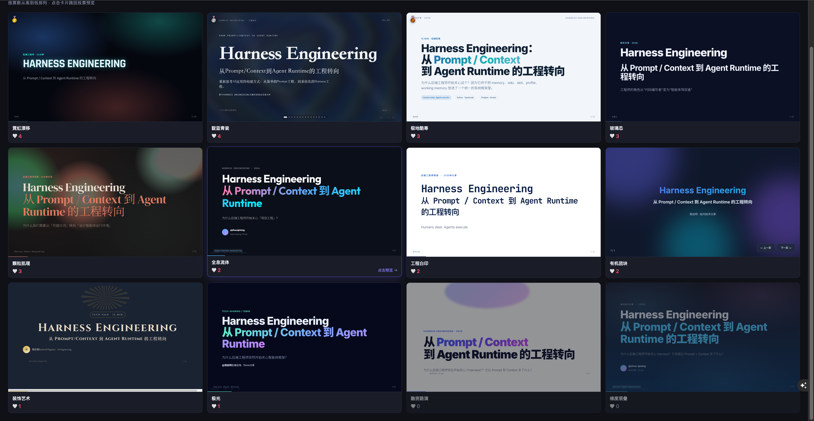

<p align="right">
  <a href="./README.md">English</a> | <a href="./README-CN.md">简体中文</a>
</p>

# Aesthetic Deck 🦋

一个用于探索 **AI & Aesthetics** 在 PPT 风格设计落地的样式空间。

线上演示：`https://extraordinary-llama-d25dda.netlify.app/`

## Aesthetic Deck 是什么？

**Aesthetic Deck** 是一个基于 Web 的 PPT 风格样式空间，作者日常喜欢与常用的风格，和自己新增设计的都被收录在 Aesthetic Deck。

你可以在此对喜欢的风格投票。

## 功能

- PPT 风格列表与 iframe 实时预览
- 点赞 / 取消点赞交互
- 按票数排序的结果页
- 结果卡片可跳回对应风格预览
- 自己筛选、重新设计并封装的 PPT 样式模板

## 截图

第二页：投票结果。



## 项目结构

```text
Aesthetic-Deck/
  index.html              # 投票与预览页面
  results.html            # 投票结果页面
  reset.html              # 重置工具页面
  harness-engineering.html
  js/                     # 投票、存储、Firebase 与 UI 逻辑
  styles/                 # 页面与结果页样式
  ppt-styles/             # 已封装的 PPT 风格模板
  aesthetic-deck-skill/   # 打包后的 Aesthetic Deck skill
  assets/                 # README 截图与项目素材
```

## Aesthetic Deck Skill

这 12 个筛选出的风格也被单独打包成了一个可复用 skill：

- `aesthetic-deck-skill/`
- `aesthetic-deck-skill/SKILL.md`

这个 skill 包含已筛选主题的 CSS 文件、基础 deck runtime、起始模板，以及当前 12 个风格的 standalone 示例。

相比直接使用源库，Aesthetic Deck Skill 做了一层更偏“生成稳定性”的重新封装。我对部分样式进行了筛选、新增设计和二次整理，并加入了一些版式防错机制，例如响应式字号控制、容器溢出约束、图片尺寸保护、网格间距规范和短屏压缩策略，尽量避免 AI 生成 PPT 时出现内容溢出、错误截断、字号失衡或布局被撑坏的问题。

因此，这个 skill 不只是样式集合，也是在尝试让 AI 生成的 deck 更稳定、更可读，也更接近一个可直接展示的成品。

## 当前 PPT 风格

当前风格集合包括：

- Neon Drift
- Pitch Deck VC
- Dimensional Layering
- Art Deco
- Holographic Fluid
- Arctic
- Engineering Whiteprint
- Aurora
- Glassmorphism
- Indigo Porcelain
- Organic Blob
- Grain Texture

## Notes

这个仓库是我关于 **AI & Aesthetics** 持续探索的一部分：

- AI & verbal aesthetics
- AI & visual aesthetics
- AI & logical aesthetics

**Aesthetic Deck** 目前聚焦视觉美学：让演示风格变得可复用、可比较，也更具有审美表达。

## 致谢

感谢 `guizang-ppt` 和 `html-ppt` 原作者的启发与基础工作；当前项目中的大部分样式也包含我自己新增设计与重新封装的部分。
